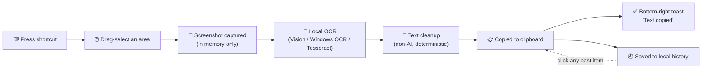
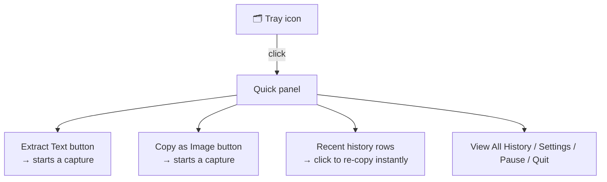

<div align="center">

# Potli

**Your little bundle of everything you copy.**

Press a shortcut → drag-select any area of your screen → the text is read locally
and instantly copied. No cloud, no upload, no telemetry.

[](#-macos)
[](#-windows)
[](#-linux)
[](#a-note-on-code-signing)

<sub>This repo doubles as the Homebrew tap (it's named <code>homebrew-potli</code>, which is all Homebrew requires) — so it's public, source included, so that <code>brew install</code> works for anyone.</sub>

</div>

---

## Contents

- [How it works](#how-it-works)
- [Features](#features)
- [Install](#install)
  - [macOS](#-macos)
  - [Windows](#-windows)
  - [Linux](#-linux)
- [Using Potli](#using-potli)
- [Privacy](#privacy)
- [A note on code signing](#a-note-on-code-signing)
- [Development](#development)

---

## How it works



Everything left of the clipboard happens **on your machine** — nothing is ever sent
anywhere. The same flow works for images ("Copy as Image" instead of OCR), and
anything you copy normally elsewhere on your Mac/PC also flows into history for
quick re-copying later via the tray's quick panel.

<details>
<summary><strong>What the tray quick panel looks like, conceptually</strong></summary>

<br>



</details>

---

## Features

- **Instant OCR from anywhere on screen** — drag-select any region; text lands on
  your clipboard in about a second.
- **Runs fully offline** — Apple Vision on macOS, Windows OCR on Windows, and a
  bundled Tesseract.js engine everywhere as a fallback. No screenshot is ever
  uploaded or written permanently to disk.
- **Copy as Image** — grab a region as a plain image instead of running OCR on it.
- **Searchable local history** — every capture (and everything else you copy) is
  kept locally so you can find and reuse it later.
- **Encrypted at rest** — history is encrypted using your OS's own secure storage
  (Keychain / DPAPI / Secret Service) when available.
- **Lives in your tray / menu bar** — a quick panel for capture, recents, and
  settings, without cluttering your Dock or taskbar.
- **Auto-paste (optional)** — simulate the paste keystroke into whatever app was
  focused before the capture, so the text lands exactly where you meant to type it.

---

## Install

> **Heads up:** these builds are not code-signed (see [below](#a-note-on-code-signing)),
> so each OS's first-run gatekeeper will flag them once. The steps below include the
> one-time fix for each platform — after that, it's a normal app.

### 🍎 macOS

<details open>
<summary><strong>Option A — Homebrew (recommended)</strong></summary>

<br>

```bash
brew tap mishrabhavesh/potli
brew install --cask potli
```

macOS will say Potli "can't be opened" or "is damaged" the first time — that's
Gatekeeper reacting to the missing signature, not a broken download. Fix it once:

```bash
xattr -dr com.apple.quarantine "/Applications/Potli.app"
```

Then open Potli as usual. Future updates: `brew upgrade --cask potli`.

</details>

<details>
<summary><strong>Option B — manual DMG download</strong></summary>

<br>

1. Grab the latest `Potli-x.y.z-arm64.dmg` (Apple Silicon) or `Potli-x.y.z.dmg`
   (Intel) from the [Releases page](../../releases).
2. Open the DMG and drag Potli into Applications.
3. Run the same `xattr -dr com.apple.quarantine` command as above, pointed at
   `/Applications/Potli.app`.

</details>

### 🪟 Windows

<details>
<summary><strong>Installer download</strong></summary>

<br>

1. Download the latest `Potli.Setup.x.y.z.exe` from the [Releases page](../../releases).
2. Run it. **SmartScreen will show "Windows protected your PC"** — this is the same
   unsigned-app warning as macOS's Gatekeeper, not a virus flag. Click **More info →
   Run anyway**.
3. Follow the installer — you can choose the install location and whether to create
   shortcuts.

</details>

### 🐧 Linux

<details open>
<summary><strong>Debian / Ubuntu (apt, recommended — auto-updates)</strong></summary>

<br>

```bash
curl -fsSL https://mishrabhavesh.github.io/apt-potli/potli-archive-keyring.asc \
  | sudo gpg --dearmor -o /usr/share/keyrings/potli-archive-keyring.gpg

echo "deb [arch=amd64,arm64 signed-by=/usr/share/keyrings/potli-archive-keyring.gpg] https://mishrabhavesh.github.io/apt-potli ./" \
  | sudo tee /etc/apt/sources.list.d/potli.list

sudo apt update
sudo apt install potli
```

This adds a signed, GitHub-Pages-hosted APT repository ([`apt-potli`](https://github.com/mishrabhavesh/apt-potli)) —
after this one-time setup, `sudo apt update && sudo apt upgrade` picks up new
Potli versions automatically, same as any other apt package. To remove it later:
`sudo apt remove potli` (and delete `/etc/apt/sources.list.d/potli.list` +
the keyring file if you also want the repo itself gone).

</details>

<details>
<summary><strong>Debian / Ubuntu — local .deb download (no repo, no auto-update)</strong></summary>

<br>

1. Grab the latest `potli_x.y.z_amd64.deb` (Intel/AMD) or `potli_x.y.z_arm64.deb`
   (ARM) from the [Releases page](../../releases).
2. Install it with apt so dependencies resolve automatically:

```bash
sudo apt install ./potli_x.y.z_amd64.deb
```

This is real `apt` — it resolves and installs any missing shared-library
dependencies for you, and registers Potli with `dpkg` like any other package, so
`sudo apt remove potli` cleanly uninstalls it later. Unlike the repo above, you'll
need to repeat this manually for each future version.

</details>

<details>
<summary><strong>AppImage (any distro, no install needed)</strong></summary>

<br>

1. Grab the latest `Potli-x.y.z.AppImage` (Intel/AMD) or `Potli-x.y.z-arm64.AppImage`
   (ARM) from the [Releases page](../../releases).
2. Make it executable and run it:

```bash
chmod +x Potli-x.y.z.AppImage
./Potli-x.y.z.AppImage
```

No installation, no root needed — just run the file. Good for distros other than
Debian/Ubuntu, or if you'd rather not install a `.deb`.

</details>

---

## Using Potli

| Action | Default shortcut |
| --- | --- |
| Extract text from a screen region | shown in Settings → Keyboard (customizable) |
| Copy a screen region as an image | shown in Settings → Keyboard (customizable) |

- Click the tray icon for the quick panel: capture buttons up top, your most recent
  history items below, and Settings/Pause/Quit at the bottom.
- Click any history row to instantly re-copy it — you'll see a brief highlight on
  the row and a "Text copied" confirmation in the bottom-right corner.
- Everything is searchable from **View All History**.

---

## Privacy

Screenshots exist only in memory for the duration of one capture and are never
written to disk, except for a transient temp file some native OCR helpers require to
read the image — that file is deleted immediately after recognition. History (text
and saved images) is stored locally, encrypted at rest with your OS's own secure
storage when available, and never transmitted anywhere. No analytics, no telemetry,
no network calls other than the OS's own permission-settings deep links.

---

## A note on code signing

Potli isn't currently signed with an Apple Developer ID or a Windows code-signing
certificate — that's why each OS shows a one-time "unknown developer" warning on
first run (worked around above). This doesn't affect how the app behaves once past
that first launch; it just means the OS can't yet verify who published it.

---

## Development

<details>
<summary><strong>Expand for architecture, build commands, and internals</strong></summary>

### Getting started

Requirements: Node.js 18+.

```bash
npm install
npm run dev
```

`npm run dev` starts the Vite dev server and Electron together (via `concurrently`),
rebuilding the main process on save. The app registers its tray icon and, on first
run, opens the onboarding window.

```bash
npm run typecheck     # tsc --noEmit for both main and renderer
npm test              # run the vitest unit test suite once
npm run test:watch    # watch mode
npm run lint          # eslint
```

### Building & packaging

```bash
npm run build           # compiles renderer (Vite) + main process (tsc) into dist/
npm run package         # build + electron-builder for the current OS
npm run package:mac     # dmg + zip, arm64 + x64
npm run package:win     # nsis installer, x64 + arm64
npm run package:linux   # AppImage + deb, x64 + arm64
```

Packaging configuration lives in `electron-builder.yml`. `resources/` (the OCR helper
scripts and tray icons) is copied into the packaged app via `extraResources`, so it's
available at `process.resourcesPath` at runtime regardless of platform.

Releases are automated: pushing a `package.json` version bump to `main` triggers
`.github/workflows/release-homebrew.yml`, which builds macOS + Linux artifacts,
publishes a GitHub Release, and updates the `homebrew-potli` tap. See
`CI_CD_SETUP.md` for the one-time setup this needs.

#### Code signing / notarization

This repo does not include signing credentials. Before distributing signed builds:

- **macOS**: set `CSC_LINK`/`CSC_KEY_PASSWORD` (or `CSC_NAME`) and notarization
  credentials (`APPLE_ID`, `APPLE_APP_SPECIFIC_PASSWORD`, `APPLE_TEAM_ID`) before
  running `npm run package:mac`. Screen Recording/Accessibility permission prompts
  only work correctly on a signed, notarized build.
- **Windows**: set `CSC_LINK`/`CSC_KEY_PASSWORD` for an EV/OV code-signing
  certificate before running `npm run package:win`.
- **Linux**: AppImage/deb builds are unsigned by default, which is normal.

#### Linux APT repo

`sudo apt install potli` (from the [Install → Linux](#-linux) section above) is
backed by a self-hosted, GPG-signed flat APT repository — the
[`apt-potli`](https://github.com/mishrabhavesh/apt-potli) repo, served over GitHub
Pages, mirroring how `homebrew-potli` hosts the Cask. `scripts/update-apt-repo.sh`
regenerates and re-signs it (`Packages`/`Packages.gz`/`Release`/`Release.gpg`/
`InRelease`) on every version release; see `CI_CD_SETUP.md` for the one-time GPG
key + repo setup this depends on.

It's a "latest" channel, not a version archive — each publish replaces the
previous `.deb` in `apt-potli/pool/` rather than keeping every past version
installable, which keeps the repo's working tree small (its git history still
grows with each replaced blob, since git doesn't truly discard old blob content on
a normal commit).

### Replacing the app icon

`build/icon.png` (1024×1024) and the tray icons in `resources/` are generated
placeholders (see `scripts/generate_icons.py`) — a simple crop-bracket mark, not
final brand art. Swap `build/icon.png` for your real icon at 1024×1024 and
electron-builder will derive the platform-specific `.icns`/`.ico`/Linux icon set
automatically. Replace `resources/trayIconTemplate.png` (+`@2x`) for macOS (must stay
black-on-transparent — macOS auto-tints template images) and `resources/trayIcon.png`
(+`@2x`) for Windows/Linux.

### Architecture

```
src/
  main/                    Electron main process (Node context)
    windows/                 main window + per-display selection overlay + bounds memory
    shortcuts/                global shortcut registration/validation
    capture/                  display enumeration + desktopCapturer-based screenshot + crop
    ocr/                       OCR engine abstraction + macOS/Windows/Tesseract adapters
    clipboard/                 clipboard write + platform-aware auto-paste
    tray/                      tray/menu-bar icon + menu
    permissions/               macOS Screen Recording / Accessibility status
    settings/, history/        electron-store-backed persistence (encrypted at rest)
    security/                  OS-secure-storage-backed encrypt/decrypt helpers
    ipc/                       every IPC handler, each payload validated with zod
    notifications/             the small bottom-right "Text copied" toast window
    preload.ts                contextBridge surface — the only thing renderers can call

  renderer/                 React UI (browser context, no Node access)
    pages/                    Quick Capture, History, Settings (Keyboard/OCR/Appearance),
                               Permissions, About, Onboarding
    quickpanel/                the tray's floating quick-access panel
    overlay/                   the fullscreen selection UI + the toast UI (two small
                               React trees loaded into the overlay/toast windows)
    stores/                    zustand stores, kept in sync with main via IPC push
    components/, hooks/

  shared/                   Pure, dependency-light code importable from both main and
                             renderer (and from tests without Electron):
    types/                     AppSettings, HistoryItem, OcrResult, ...
    ipc/                       channel name constants + zod schemas
    ocr/textCleanup.ts         the non-AI cleanup pipeline
    shortcut/                  accelerator validation + Cmd/Ctrl symbol formatting

resources/
  mac/VisionOCR.swift        Swift CLI helper invoked via `swift` (Apple Vision OCR)
  windows/OcrHelper.ps1      PowerShell helper invoked via `powershell.exe` (WinRT OCR)
```

#### Why a Swift/PowerShell helper instead of a native Node addon?

Both native OCR APIs (Vision, Windows.Media.Ocr) are easiest to reach through their
platform's own scripting story — Swift's `swift` interpreter ships with Xcode Command
Line Tools, and PowerShell's WinRT projection is built into every modern Windows
install. This avoids maintaining prebuilt native Node addons for four architecture/OS
combinations. If either helper is unavailable (toolchain missing, language pack
missing), `OcrService` transparently falls back to the bundled Tesseract.js engine —
the user never sees a hard failure over it.

#### Why no native image-processing dependency?

Cropping the captured screenshot uses Electron's built-in `nativeImage.crop()`
instead of a library like `sharp`. Early in development this project did use `sharp`
for cropping, and packaging it turned up exactly the kind of cross-platform fragility
it's meant to avoid — its native binary failed to load in one Linux target here.
Since Electron already gives us a perfectly good crop primitive, there was no reason
to carry that risk across three OSes and two CPU architectures for one `.extract()`
call.

#### IPC security

`contextIsolation: true`, `nodeIntegration: false`, and `sandbox: true` are set on
every `BrowserWindow` (main window, per-display selection overlays, and the toast
window). The preload script (`src/main/preload.ts`) exposes a narrow, fully-typed
`window.potli` API — nothing else from Node/Electron is reachable from web
content. Every IPC payload is re-validated on the main-process side with zod
(`src/shared/ipc/schemas.ts`) before it touches any handler logic, so a compromised
or buggy renderer can't smuggle malformed data across the boundary.

**Important if you ever edit `preload.ts`:** with `sandbox: true`, Electron's
sandboxed preload environment cannot `require()` your own local files by relative
path (only a small allowlist of Node built-ins plus `electron` itself) — a preload
script split across multiple compiled files will fail silently at runtime with
"module not found", leaving the window showing nothing but its background color. To
avoid this, `preload.ts` is bundled into one self-contained `dist/main/preload.js` via
esbuild (`npm run build:preload`, wired into both `build:main` and the dev flow) —
don't remove that step or point `webPreferences.preload` at the raw tsc output.

**Why `scripts/dev-launch.js` exists:** `tsc-watch`'s `--onSuccess` runs one command
after each successful recompile, and in practice it doesn't reliably hand compound
shell commands (`a && b`) to a real shell — `npm run build:preload && electron .`
gets parsed as `npm run build:preload` with `&&`, `electron`, `.` tacked on as extra
CLI arguments, which esbuild then choked on as bogus extra input files. The fix is to
give `--onSuccess` a single unambiguous command (`node scripts/dev-launch.js`) that
does the bundle-then-launch sequence itself in plain Node.

### Adding a new OCR engine later

Implement the `OcrEngine` interface (`src/shared/types/ocr.ts`):

```ts
interface OcrEngine {
  readonly id: string;
  readonly label: string;
  isAvailable(): Promise<boolean>;
  recognize(image: Buffer, options?: OcrOptions): Promise<OcrResult>;
  dispose?(): Promise<void>;
}
```

Register it in `src/main/ocr/ocrService.ts`. Nothing else in the app needs to change
— capture, cleanup, clipboard, and history all talk to `OcrService`, never to a
concrete engine.

### Testing

```bash
npm test
```

Automated coverage: text cleanup pipeline (whitespace normalization, URL/email/number
preservation, line-break handling), shortcut accelerator validation and recording,
IPC payload schemas, settings persistence (merge/validate/notify), history store
(add/delete/clear/notify), secure-storage encrypt/decrypt (including the
unavailable-fallback path), and clipboard read/write/error-handling.

Recommended manual test pass before release (needs real hardware per platform):
single vs. multi-monitor, Retina/HiDPI vs. standard DPI, light vs. dark mode,
permission-denied states, no-text-detected regions, very small/very large text, long
multi-paragraph text, numbers, URLs, and email addresses.

### Platform notes

**macOS** — runs as a menu-bar-only app (no Dock icon, `LSUIElement: true`). Screen
Recording permission is required for screenshot capture; Accessibility is only
needed if "Copy and paste automatically" is turned on — both are explained, with a
direct link to the relevant System Settings pane, in Settings → Permissions. OCR
uses Apple's Vision framework via a bundled Swift helper, falling back to Tesseract
automatically if the Xcode Command Line Tools aren't installed.

**Windows** — runs from the system tray; no extra OS permissions are needed for
screen capture. OCR uses the built-in `Windows.Media.Ocr` API (the same engine
behind the Snipping Tool's text actions) via a bundled PowerShell helper, and needs
the relevant language pack installed, falling back to Tesseract automatically if
unavailable. "Copy and paste automatically" simulates Ctrl+V into the foreground
window via `SendKeys`.

**Linux** — tray icon support depends on the desktop environment (AppIndicator/
StatusNotifier support varies — GNOME needs an extension, KDE/most others work out
of the box); the app is still fully usable through its main window and global
shortcut without one. OCR runs on the Tesseract.js fallback (no first-party Linux
native adapter exists yet — the `OcrEngine` interface above is ready for one).
"Copy and paste automatically" uses `xdotool`, which works on X11; Wayland
compositors generally block synthetic input for security reasons, in which case
Potli still leaves the text on the clipboard and shows a "Text copied" toast rather
than failing silently.

</details>
